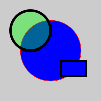

<details class="prereq" markdown="1"><summary>Assumed Knowledge</summary>

<!--  * <a href="./lists">Lists</a>
  * <a href="./loops">Loops</a>-->
</details>

<details class="outcomes" markdown="1"><summary>Learning Outcomes</summary>
  * Understanding how to use colors for borders, inside of a filled shape, and background.
</details>

## Author: Gaurav Gupta

The three primary colors are,

- Red
- Green
- Blue

Each primary color component has a range of 0 (none) to 255 (full) in processing.

A color is represented as a combination of red, green and blue, in that order.

Thus,

- (255, 0, 0) represents full red, no green, no blue => RED
- (255, 255, 0) represents full red, full green, no blue => YELLOW.
- (50, 50, 50) represents equal amounts of red, green and blue => DARK GREY.
- (200, 200, 200) represents equal (but high) amounts of red, green and blue => LIGHT GREY.
- (0, 0, 0) represents BLACK.
- (255, 255, 255) represents WHITE.

When the three primary colors are the same, you can just write that value once.

Hence,

- (0) is the same as (0, 0, 0) (BLACK)
- 127) is the same as (127, 127, 127) (GREY)
- (255) is the same as (255, 255, 255) (WHITE)

## Color selector

You can select a color of your choice by following these steps:

1. Click "Tools"
2. Click "Color Selector"
3. Slide up and down in the right shade slider to choose base color. 
4. Select exact color in the left panel.
5. Click on "Copy".

## To what can we apply colors?

We can apply colors to background, borders of all shapes, and insides of *filled* shapes (like circles and rectangles, but not lines).

## Background

Default background is grey.

Syntax:

```
background(<color>);
```

Example:

```
background(255, 0, 0); //red
background(200, 200, 50); //yellow-ish
background(0); //same as background(0, 0, 0) or black
```


## BORDERS

Default border color is black.

Syntax:

```
stroke(<color>);
```

Example:

```
stroke(0, 255, 0); //green
stroke(200, 200, 50); //yellow-ish
stroke(255); //same as stroke(255) or white
```

You can change the thickness of the borders using `strokeWeight`.

- `strokeWeight(3)` means 3 times normal thickness.
- `strokeWeight(10)` means 10 times normal thickness.
- `noStroke()` means no borders.

## INSIDES OF FILLED SHAPES

Fill color only applies to enclosed shapes like circles, triangles, rectangles, not lines. Default fill color is white.

Syntax:

```
fill(<color>);
```

Example:

```
fill(0, 0, 255); //blue
fill(200, 200, 50); //yellow-ish
fill(255); //same as fill(255) or white
```

`noFill()` means no fill color (transparent background).

## Bringing opacity into the mix

In addition to the three primary colors, you can also add a fourth attribute to a color for alpha or opacity, or in simple terms, how solid should a color be. Default value for this attribute is 255 (full opacity).

- `fill(255, 0, 0, 255);` means full red.
- `fill(255, 0, 0, 200);` means nearly-solid red.
- `fill(255, 0, 0, 100);` means semi-transparent red.
- `fill(255, 0, 0, 0);` means transparent red, which means no red.

Opacity can also be applied to borders and background, but is mostly used for `fill`.

## Final note

Border colors and fill colors apply to all shapes until you change these properties.

Example:

```
size(200, 200);

stroke(255, 0, 0);
fill(0, 0, 255);

circle(100, 100, 120);

stroke(0);
strokeWeight(5);

rect(120, 120, 50, 30);

fill(0, 255, 0, 100);

circle(60, 60, 80);
```

The first big circle will have red borders, blue fill.
The rectangle will have very thick black borders, blue fill (fill color not changed).
The second smaller circle will have very thick black borders (border not changed), green fill.

